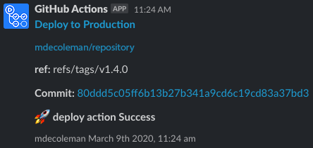

# Slack Job Status Notifier

GitHub Action that pushes job status notifications to slack.

# Setup

For this action to post to slack you must setup [Incoming Webhooks](https://api.slack.com/messaging/webhooks) in the slack channel you want to notify.

Once this integration has been setup in the channel, create a new secret in your GitHub repository called `SLACK_TOKEN` and set the value to the `Webhook Url`

# Inputs

For documentation of available inputs and outputs see [action.yml](action.yml)

# Usage

```yaml
- uses: mdecoleman/slack-job-status-notifier@v1
      if: always()
      with:
        slack_token:  ${{ secrets.SLACK_TOKEN }}
        slack_channel: "<your-channel-name>"
        status: ${{ job.status }}
        job_name: "<your-friendly-job-name>"
```

# Output



# License

The scripts and documentation in this project are released under the [MIT License](LICENSE)
